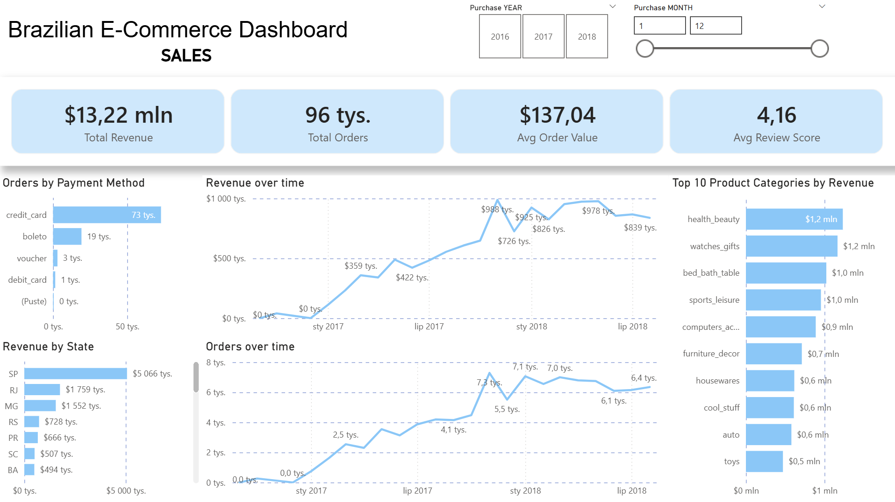
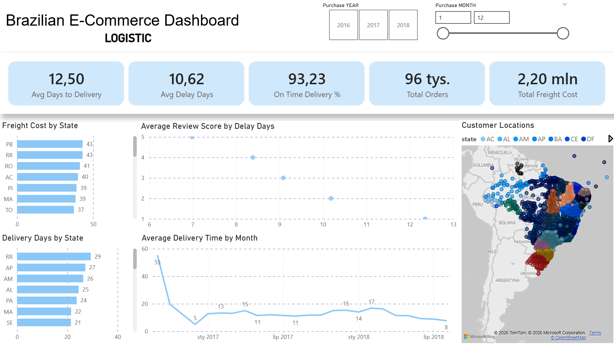
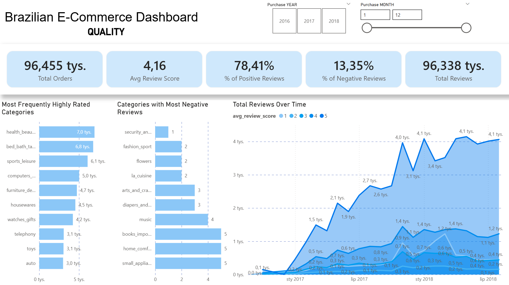

# E-commerce Learning Project: Full Data Lifecycle
# (Raw Data → ETL in Databricks → Power BI → ML)

## Learning Objectives

The main goal of this project is to replicate the **complete data lifecycle** in a modern e-commerce enterprise.  
Project is based on this dataset: [Brazilian E-Commerce Public Dataset by Olist]([PowerBI/01_SalesDashboard.png](https://www.kaggle.com/datasets/olistbr/brazilian-ecommerce))

Through this project, I am developing competencies in the following areas:

---

### 1. Data Engineering with Databricks & Medallion Architecture

- **Goal** – learn how to use **Databricks** to transform raw CSV data.
- **Medallion Architecture** – implement:
  - `Bronze` – raw data (Extract)
  - `Silver` – cleaning data
  - `Gold` – structuring analytical views

- **Two output structures from the Gold layer**:
  - **Star schema** (fact & dimension tables) – for efficient analysis in **Power BI**
  - **One big table** (denormalized) – ready for **machine learning models**
 

### 2. Power BI Dashboards

- **Learn to build dashboards** in Power BI from scratch.
- Connect to the star schema created in Databricks.
- Create interactive visualizations to explore business metrics.

#### Sales Performance

**Key Insights:**
* **Revenue Concentration:** The state of São Paulo (SP) is the leader in both order volume and total revenue.
* **Payment Preferences:** Credit cards are the dominant payment method.

#### Logistics & Delivery

**Key Insights:**
* **Delivery Success:** The overall on-time delivery rate is at over 93%.
* **Geographical Challenges:** Northern states like Roraima (RR) and Amapá (AP) have the longest delivery times (up to 29 days) and the highest average freight costs.
* **Impact of Delays:** There is a strong negative correlation between delivery delay and customer satisfaction. As delay days increase, the average review score drops.

#### Customer Quality & Satisfaction

**Key Insights:**
* **Overall Satisfaction:** The average review score is high (4.16), with over 78% of reviews being strictly positive (4 or 5 stars).
* **Problematic Categories:** Categories like "Security and Services" and "Fashion Sport" have the highest ratio of negative reviews, indicating potential issues with product quality or fulfillment in those specific niches.

### 3. Machine Learning Modeling (Bonus / Practice)

- I already know how to build ML models (junior level). I read a lot about it and learn every day :)  
- I also wanted to include model training in this project as a bonus.
- I used the firs time MLflow in Databricks. I know that MLflow is a powerful tool, but I also know that I need to practice it more.

### 4. All in one Pipeline

- Everything is connected in one pipeline in Databricks from raw data to ETL. 
- Naw it can be easily updated by a trigger like a schedule or new data arrival.

---

